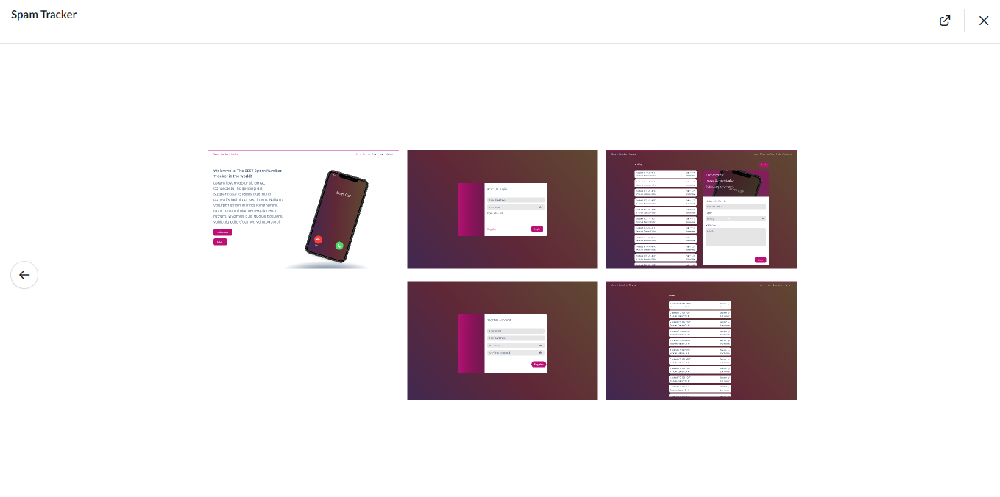

# Group-Project2

# Spam Num Tracker

### Deployed Heroku URL:
https://spamnumbertracker.herokuapp.com/

### Deployed WEb URL:

https://github.com/sujatha-m/Group-Project2


### Project Presentation Slides URL:

https://docs.google.com/presentation/d/1OnWRDeEeE8K4jemnzZ9s_pFp4DiJ7ZoMWG0iySpO0RE/edit?usp=sharing


## Badges
[](https://img.shields.io/github/followers/sujatha-m?style=social)
[](https://img.shields.io/website?url=https%3A%2F%2Fsujatha-m.github.io%2FWeather-Dashboard%2FDevelop%2F)
[](https://img.shields.io/redmine/plugin/stars/redmine_xlsx_format_issue_exporter?color=purple)

## Team Members:

Member 1: Sujatha Mallela, sujatha-m, https://github.com/sujatha-m/

Member 2: Gayathiri Ramamoorthy, mathigayathri2001, https://github.com/mathigayathri2001

Member 3: Brian Dinh, MitoKito, https://github.com/MitoKito

### Motivation
-------------

## User-story
```
AS A User

I am able to sign-up or sign-in to the spam tracker application

SO THAT I can report the spam number which i received, and view all spam numbers which are stored in the database. And have option to delete any reported number from the database.

```

## Table of Contents
   * [Description](#description)
   * [Usage](#usage)
   * [Built with](#built-with)
   * [Installation](#installation)
   * [Badges](#badges)
   * [Contributing](#contributing)
   * [License](#license)
   * [Visuals](#visuals)

## Description
**S**pam-**N**um-**T**racker! 

Spam Numbers Tracker and Renderer for Analysis

An application that hosts a database service for users to report spam calls received on their phones.
The database would serve as a central repository to hold list of spam numbers reported by all users registered with the application.
Users in turn can subscribe (if interested) for getting  updated numbers from the database (so that they could add filters in their phones to block calls if received in the future).

The numbers held in the database would serve as inputs to cyber or security departments for analysis.

## Wire Frame


## MVC Flow Diagram:


## Built with
* JavaScript
* NodeJS
* Node Packages:
* MYSQL2
* sequelize
* Express
* Express-handlebars
* Passport
* passport-local
* morgan
* bcryptjs

### Front End Framework:
Bulma: https://bulma.io/

## Visuals


## Installation 
Run npm install to install all dependencies. To use the application locally run server.js

## Usage
```sh
      node server.js  
```

## Contributing
Pull requests are welcome. For major changes, please open an issue first to discuss what you would like to change.
Please make sure to update tests as appropriate.


## License 
[](https://img.shields.io/npm/l/isc?color=Blue&style=plastic)

### Directions for Future Development
* Add capability to search internally for existence of reported number in the database and do not add if the number       already exists in the database
* Delete number reported by a user (from his login)
* View reported numbers by city
* Add support for the application to integrate with a phone’s contact application to update and filter/block spam call numbers (received from the database)  

