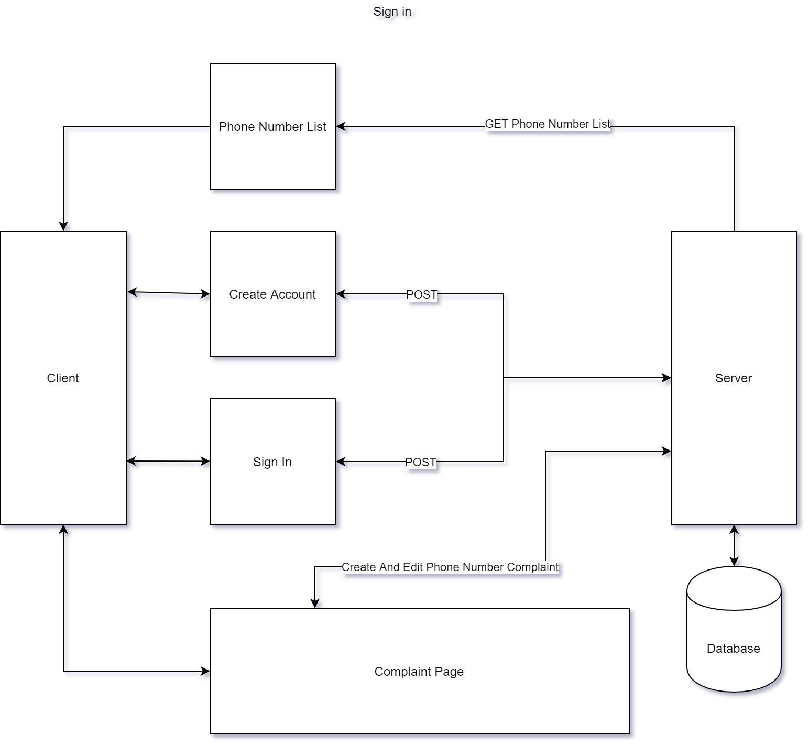

# Group-Project2
Spam Numbers Tracker and Renderer for Analysis

An application that hosts a database service for users to report spam calls received on their phones.
The database would serve as a central repository to hold list of spam numbers reported by all users registered with the application.
Users in turn can subscribe (if interested) for getting  updated numbers from the database (so that they could add filters in their phones to block calls if received in the future).

The numbers held in the database would serve as inputs to cyber or security departments for analysis.

# Project Wireframe
